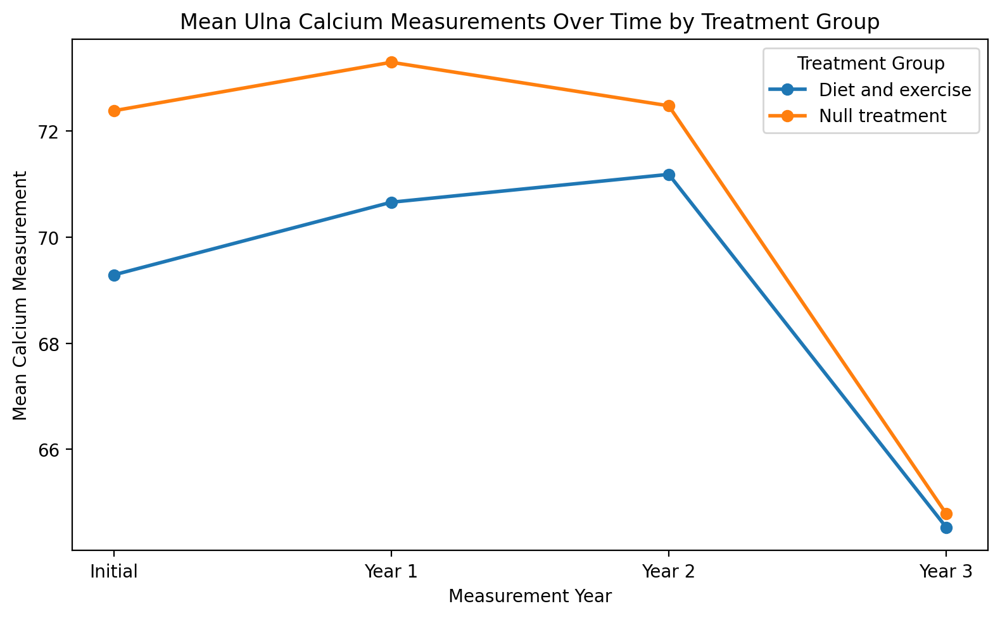
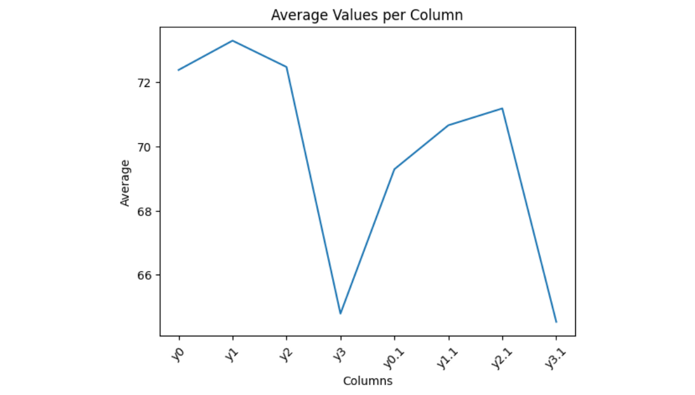

```{r}
library(tidyverse)
library(ggplot2)
library(scales)
library(knitr)
```

# Busiest Airports Analysis

## Overview

This section looks at passenger totals for six major international airports from 2020 through 2025. The goal is to compare how airport traffic changed over time and to identify which airports handled the most passengers during these years. To support this analysis, I included a summary table and a line graph. The table shows the values directly, while the graph makes the overall trends easier to compare.

## Results

```{r}
#| label: tbl-airports
#| tbl-cap: "Passenger totals for six busiest airports, in millions."

airport_data <- tibble(
  airport = c(
    "Hartsfield-Jackson Atlanta (ATL)",
    "Frankfurt Airport (FRA)",
    "Beijing Daxing Intl (PKX)",
    "Dubai International (DXB)",
    "Heathrow Airport (LHR)",
    "Tokyo Haneda (HND)"
  ),
  iata = c("ATL", "FRA", "PKX", "DXB", "LHR", "HND"),
  `2020` = c(42918685, 18768601, 25051012, 25836771, 22111469, 31055210),
  `2021` = c(75704760, 24812849, 37000000, 29110609, 61614508, 50290705),
  `2022` = c(93699630, 48918482, NA, 86994365, 79183364, 78719302),
  `2023` = c(104653451, 59355389, 49441029, 92331506, 83884572, 85900167),
  `2024` = c(106302208, 63189666, 53618949, 95200000, 84463000, 91430000),
  `2025` = c(108067766, 61564957, NA, 92331506, 83884572, 85900167)
)

airports_long <- airport_data |>
  pivot_longer(
    cols = `2020`:`2025`,
    names_to = "year",
    values_to = "passengers"
  ) |>
  mutate(year = as.integer(year))

airports_table <- airports_long |>
  mutate(passengers_millions = round(passengers / 1e6, 2)) |>
  select(airport, year, passengers_millions) |>
  pivot_wider(
    names_from = year,
    values_from = passengers_millions
  )

knitr::kable(airports_table)
```

```{r}
#| label: fig-airports
#| fig-cap: "Passenger trends for six busiest airports from 2020 to 2025."

airports_long |>
  drop_na(passengers) |>
  mutate(passengers_millions = passengers / 1e6) |>
  ggplot(aes(x = year, y = passengers_millions, color = airport, group = airport)) +
  geom_line(linewidth = 1) +
  geom_point(size = 2) +
  scale_x_continuous(breaks = 2020:2025) +
  scale_y_continuous(labels = label_number(suffix = "M")) +
  labs(
    title = "Busiest Passenger Airports (2020-2025)",
    x = "Year",
    y = "Total Passengers",
    color = "Airport"
  ) +
  theme_minimal()
```

## Interpretation

As shown in @tbl-airports, passenger totals increase after 2020 for most of the airports in this dataset. This suggests a broad recovery in airport traffic over time, although the rate of increase is not the same for every airport. Hartsfield-Jackson Atlanta has the highest passenger total by the end of the period, while Dubai International, Tokyo Haneda, and Heathrow Airport also remain in the top group.

@fig-airports makes the trends easier to compare because it shows how each airport changes across years instead of only listing totals. Atlanta shows the strongest overall increase and finishes at the highest level in the dataset. Dubai, Haneda, and Heathrow also stay at relatively high passenger levels. Frankfurt remains below the top group. Beijing Daxing has missing values in some years, so its trend is less complete than the others.

Together, the table and graph show both the size of the passenger totals and how those totals changed over time. The table is useful for exact values, while the graph makes year to year patterns easier to see. Looking at both visualizations together shows that these airports did not recover at the same pace, even though most of them grew strongly after 2020.

# Monte Carlo Numerical Integration

## Overview

This section uses Monte Carlo numerical integration to estimate the area under a Beta distribution probability density function. For this assignment, the function is the Beta distribution with parameters `shape1 = 2` and `shape2 = 2`. The x-bounds are from 0 to 1, and the y-bounds are from 0 to 1.5. The Monte Carlo method works by randomly generating points inside a rectangle and checking whether each point falls on or below the function. The proportion of points under the curve is then multiplied by the area of the rectangle to estimate the integral.

## Small Multiple Visualization

```{r}
#| label: fig-mc-multi
#| fig-cap: "Monte Carlo integration for the Beta(2, 2) density at four simulation sizes."

set.seed(184)

mc_points <- function(n, x_min, x_max, y_min, y_max) {
  tibble(
    x = runif(n, min = x_min, max = x_max),
    y = runif(n, min = y_min, max = y_max)
  )
}

f <- function(x) dbeta(x, shape1 = 2, shape2 = 2)

x_min <- 0
x_max <- 1
y_min <- 0
y_max <- 1.5
rect_area <- (x_max - x_min) * (y_max - y_min)

resolutions <- c(100, 500, 1000, 5000)

mc_multi <- purrr::map_dfr(resolutions, function(n_value) {
  pts <- mc_points(n_value, x_min, x_max, y_min, y_max) |>
    mutate(
      flag = if_else(y <= f(x), "On or below curve", "Above curve"),
      sim_size = paste("n =", n_value)
    )

  estimate <- rect_area * mean(pts$flag == "On or below curve")

  pts |>
    mutate(estimate = round(estimate, 4))
})

ggplot(mc_multi, aes(x = x, y = y, color = flag)) +
  geom_point(size = 0.8, alpha = 0.5) +
  stat_function(
    fun = dbeta,
    args = list(shape1 = 2, shape2 = 2),
    xlim = c(0, 1),
    color = "black",
    linewidth = 0.8
  ) +
  facet_wrap(~ sim_size) +
  labs(
    title = "Monte Carlo Integration at Multiple Resolutions",
    x = "x",
    y = "y",
    color = "Point Location"
  ) +
  theme_minimal()
```

## Results and Discussion

@fig-mc-multi shows how Monte Carlo integration estimates the area under the Beta(2, 2) density by sampling random points inside a rectangle and checking whether they fall on or below the curve. Since this is a probability density function over its full support, the exact integral is 1. The purpose of the simulation is to estimate that value through random sampling.

The four panels make it easier to compare what happens at different simulation sizes. When the number of sampled points is small, the estimate is more affected by randomness because the rectangle is covered less evenly. As the number of points increases, the cloud becomes denser and the estimate becomes more stable.

The small multiple also helps explain why Monte Carlo integration works. The estimate depends on the proportion of sampled points that fall under the curve, and that proportion becomes more representative as the sample size increases. Because all four panels use the same function and the same bounds, the effect of simulation size is easier to see. Based on the graph and the definition of a probability density function, the exact answer for this integral should be 1.

# Planning and Prompting GenAI Tools

## Data Context

The `calcium.csv` data come from a longitudinal study of 31 women observed over four years. At the beginning of the study, researchers measured the amount of calcium in the ulna of each woman's dominant arm. The dataset then records follow up measurements at Year 1, Year 2, and Year 3. The first four columns correspond to the null treatment group, while the second four columns correspond to the diet and exercise treatment group. Because the measurements for each treatment group are spread across multiple columns, the original file is not tidy. In its raw form, the dataset is harder to analyze directly because the treatment group and year are encoded in the column layout instead of being stored as variables.

## My Plan

I will read in `calcium.csv` without changing the original file. I will identify which columns belong to the null treatment group and which belong to the diet and exercise treatment group. I will reshape the dataset from wide format into long format so that each row represents one observation at one time point for one group member. I will create one column for treatment group, one column for year, and one column for calcium measurement. I will label the treatment groups clearly and label the years as Initial, Year 1, Year 2, and Year 3. I will then check that the final dataset is tidy, meaning one variable per column and one observation per row. Finally, I will create a plot that compares calcium values over time across the two treatment groups and format it with clear labels and a readable theme.

### Goal

My goal is to tidy the calcium dataset and create a visualization that compares ulna calcium measurements over time between the null treatment group and the diet and exercise treatment group.

### Needs

To complete this task, the dataset needs to be reshaped from wide format into long format. I need one column that identifies the treatment group, one column that identifies the time of measurement, and one column that stores the calcium measurement itself. I also need a clear visualization that makes it easy to compare changes over time for both groups.

### Steps

1. Read in `calcium.csv` without changing the original file.
2. Determine which columns belong to the null treatment group and which belong to the diet and exercise treatment group.
3. Reshape the data from wide format into long format so that each row represents one observation at one time point for one group member.
4. Create a treatment group variable with labels for the null group and the diet and exercise group.
5. Create a year variable with labels such as Initial, Year 1, Year 2, and Year 3.
6. Store the calcium measurements in a single numeric column.
7. Check that the final tidy dataset has one variable per column and one observation per row.
8. Create a plot that compares calcium values over time across the two treatment groups.
9. Use clear labels, a readable theme, and an informative caption so the visualization is easy to understand.

## Plan Informed Response

For this part, I used OpenAI ChatGPT to process my already written plan and the calcium dataset context. I did not ask it to generate a new plan, new code, or a new solution approach.

### Plan Informed Prompt

I already wrote my own plan for tidying and visualizing `calcium.csv`. Please do not generate code. Using only the data context and my plan below, create a clear visualization that compares calcium measurements over time between the null treatment group and the diet and exercise treatment group. The visualization should reflect the tidy structure described in my plan, with treatment group, year, and calcium measurement used to support the comparison. Label the years as Initial, Year 1, Year 2, and Year 3, and use clear labels and a readable format.

Data context: `calcium.csv` comes from a longitudinal study of 31 women observed over four years. The first four columns are for the null treatment group, and the second four columns are for the diet and exercise treatment group. The columns represent Initial, Year 1, Year 2, and Year 3 calcium measurements. The data are not tidy in their current format.

My plan: I will read in `calcium.csv` without changing the original file. I will identify which columns belong to the null treatment group and which belong to the diet and exercise treatment group. I will reshape the dataset from wide format into long format so that each row represents one observation at one time point for one group member. I will create one column for treatment group, one column for year, and one column for calcium measurement. I will label the treatment groups clearly and label the years as Initial, Year 1, Year 2, and Year 3. I will then check that the final dataset is tidy, meaning one variable per column and one observation per row. Finally, I will create a plot that compares calcium values over time across the two treatment groups and format it with clear labels and a readable theme.

### Plan Informed Response Text

The plan informed response was more useful because it followed the structure of the calcium dataset and the specific goal in my plan. Instead of treating each original column as a separate variable, it supported a comparison based on treatment group and year. This made it easier to compare calcium measurements over time between the null treatment group and the diet and exercise treatment group. The result was a clearer and more relevant visualization for the assignment.

### Plan Informed Response Image

```{r}
#| label: fig-plan-informed-response
#| fig-cap: "Plan informed ChatGPT response plot for the calcium data."
#| out-width: "85%"


```

## Provided Generic Response

The following generic response was given in the assignment materials.

### Generic Response Image

```{r}
#| label: fig-generic-response
#| fig-cap: "Provided generic ChatGPT response plot for the calcium data."
#| out-width: "85%"


```

### Generic Response Text

Prompt: Create a data visualization for these data. Calcium.csv

I created a visualization showing the average value of each column in your dataset.

What this shows:

Each point represents the mean (average) of one column in the dataset.

You can quickly compare which variables tend to have higher or lower values overall.

For example, some columns cluster around about 70 to 73, while others are closer to 65.

If wanted, the tool also suggested other options such as boxplots, time series plots, correlation heatmaps, and side by side comparisons.


## Comparison of Outputs

The plan informed response was more useful for this assignment because it stayed connected to the structure of the calcium dataset and to the specific goal I had already identified in my own plan. It focused on reshaping the data into tidy format, creating variables for treatment group, year, and calcium measurement, and supporting a comparison of calcium values over time between the two groups.

The provided generic response was much broader. The generic plot only showed the average value of each original column, so it did not address the fact that the file is not tidy and did not organize the measurements by treatment group and year in a way that supports the main question of the assignment. It gave a quick summary of column averages, but it did not help as much with understanding the repeated measures structure of the data.

My own work was more useful than either response because I first built a plan that matched the exact structure of the dataset and the purpose of the analysis. The comparison showed me that a detailed plan leads to a response that is more connected to the actual problem, while a generic prompt can produce an output that is simpler but less helpful for the assignment.

# Reflection

This assignment helped me understand how reproducible data analysis combines coding, organization, interpretation, and communication in one document. One thing I learned is that reproducibility is not only about getting code to run. It is also about making the workflow easy for another reader to follow. In the busiest airports section, I had to organize the airport data so that one tidy structure could support both a table and a line graph. That showed me how a well organized dataset can be reused in more than one way.

I also learned more about how simulation can support numerical reasoning. In the Monte Carlo section, the small multiple figure made it easier to see why larger sample sizes give more stable estimates. Instead of only knowing the idea in theory, I could see the point clouds become denser and the approximation behave more consistently as the number of sampled points increased.

Another thing I learned is that prompt quality matters when using GenAI tools. In the Planning and Prompting section, the plan informed response was more useful than the provided generic response because it was tied to the dataset structure and to my own goal. That gave me a clear example of why better planning leads to more useful output. Overall, this assignment showed me that good data analysis depends on clear structure, careful explanation, and making the work understandable for someone else.

\newpage

# Appendix A: GenAI Usage

## Disclosure Statement

I completed the coding, analysis, interpretation, and main writing in this assignment myself. I used OpenAI ChatGPT only in the Planning and Prompting GenAI Tools section to process my already written plan and the calcium data context. In that section, I used it to generate a plan informed visualization for comparison purposes. I did not use GenAI to generate code, debug code, or rewrite code.


## Personal GenAI Use

Tool used: OpenAI ChatGPT  
Version: GPT-5.4   
Date used: April 15, 2026

## Exact Prompt

I already wrote my own plan for tidying and visualizing `calcium.csv`. Please do not generate code. Using only the data context and my plan below, create a clear visualization that compares calcium measurements over time between the null treatment group and the diet and exercise treatment group. The visualization should reflect the tidy structure described in my plan, with treatment group, year, and calcium measurement used to support the comparison. Label the years as Initial, Year 1, Year 2, and Year 3, and use clear labels and a readable format.

Data context: `calcium.csv` comes from a longitudinal study of 31 women observed over four years. The first four columns are for the null treatment group, and the second four columns are for the diet and exercise treatment group. The columns represent Initial, Year 1, Year 2, and Year 3 calcium measurements. The data are not tidy in their current format.

My plan: I will read in `calcium.csv` without changing the original file. I will identify which columns belong to the null treatment group and which belong to the diet and exercise treatment group. I will reshape the dataset from wide format into long format so that each row represents one observation at one time point for one group member. I will create one column for treatment group, one column for year, and one column for calcium measurement. I will label the treatment groups clearly and label the years as Initial, Year 1, Year 2, and Year 3. I will then check that the final dataset is tidy, meaning one variable per column and one observation per row. Finally, I will create a plot that compares calcium values over time across the two treatment groups and format it with clear labels and a readable theme.

## Exact Response

The plan informed output produced a graph that compared calcium measurements over time between the null treatment group and the diet and exercise treatment group. The graph used the years Initial, Year 1, Year 2, and Year 3 and supported the comparison described in my plan by organizing the data around treatment group and time.

\newpage

# Appendix B: Code Appendix

## Airports Code

```{r}
#| echo: true
#| eval: false

# Load packages used in the report
library(tidyverse)
library(ggplot2)
library(scales)
library(knitr)

# Store airport passenger totals in a tibble
airport_data <- tibble(
  airport = c(
    "Hartsfield-Jackson Atlanta (ATL)",
    "Frankfurt Airport (FRA)",
    "Beijing Daxing Intl (PKX)",
    "Dubai International (DXB)",
    "Heathrow Airport (LHR)",
    "Tokyo Haneda (HND)"
  ),
  iata = c("ATL", "FRA", "PKX", "DXB", "LHR", "HND"),
  `2020` = c(42918685, 18768601, 25051012, 25836771, 22111469, 31055210),
  `2021` = c(75704760, 24812849, 37000000, 29110609, 61614508, 50290705),
  `2022` = c(93699630, 48918482, NA, 86994365, 79183364, 78719302),
  `2023` = c(104653451, 59355389, 49441029, 92331506, 83884572, 85900167),
  `2024` = c(106302208, 63189666, 53618949, 95200000, 84463000, 91430000),
  `2025` = c(108067766, 61564957, NA, 92331506, 83884572, 85900167)
)

# Reshape the airport data so each row is one airport year observation
airports_long <- airport_data |>
  pivot_longer(
    cols = `2020`:`2025`,
    names_to = "year",
    values_to = "passengers"
  ) |>
  mutate(year = as.integer(year))

# Build a table with passenger totals shown in millions
airports_table <- airports_long |>
  mutate(passengers_millions = round(passengers / 1e6, 2)) |>
  select(airport, year, passengers_millions) |>
  pivot_wider(
    names_from = year,
    values_from = passengers_millions
  )

# Display the summary table
knitr::kable(airports_table)

# Plot passenger totals over time for each airport
airports_long |>
  drop_na(passengers) |>
  mutate(passengers_millions = passengers / 1e6) |>
  ggplot(aes(x = year, y = passengers_millions, color = airport, group = airport)) +
  geom_line(linewidth = 1) +
  geom_point(size = 2) +
  scale_x_continuous(breaks = 2020:2025) +
  scale_y_continuous(labels = label_number(suffix = "M")) +
  labs(
    title = "Busiest Passenger Airports (2020-2025)",
    x = "Year",
    y = "Total Passengers",
    color = "Airport"
  ) +
  theme_minimal()
```

## Monte Carlo Code

```{r}
#| echo: true
#| eval: false

# Load packages used in this section
library(tidyverse)
library(ggplot2)

# Set a seed so the simulation is reproducible
set.seed(184)

# Generate random points inside the rectangle
mc_points <- function(n, x_min, x_max, y_min, y_max) {
  tibble(
    x = runif(n, min = x_min, max = x_max),
    y = runif(n, min = y_min, max = y_max)
  )
}

# Define the Beta(2, 2) density
f <- function(x) dbeta(x, shape1 = 2, shape2 = 2)

# Store the rectangle bounds and area
x_min <- 0
x_max <- 1
y_min <- 0
y_max <- 1.5
rect_area <- (x_max - x_min) * (y_max - y_min)

# Use four simulation sizes for the small multiple
resolutions <- c(100, 500, 1000, 5000)

# Simulate points and label whether they fall under the curve
mc_multi <- purrr::map_dfr(resolutions, function(n_value) {
  pts <- mc_points(n_value, x_min, x_max, y_min, y_max) |>
    mutate(
      flag = if_else(y <= f(x), "On or below curve", "Above curve"),
      sim_size = paste("n =", n_value)
    )

  estimate <- rect_area * mean(pts$flag == "On or below curve")

  pts |>
    mutate(estimate = round(estimate, 4))
})

# Plot the four Monte Carlo panels with the Beta curve
ggplot(mc_multi, aes(x = x, y = y, color = flag)) +
  geom_point(size = 0.8, alpha = 0.5) +
  stat_function(
    fun = dbeta,
    args = list(shape1 = 2, shape2 = 2),
    xlim = c(0, 1),
    color = "black",
    linewidth = 0.8
  ) +
  facet_wrap(~ sim_size) +
  labs(
    title = "Monte Carlo Integration at Multiple Resolutions",
    x = "x",
    y = "y",
    color = "Point Location"
  ) +
  theme_minimal()
```

## Calcium Tidy Data and Plot Code

```{r}
#| echo: true
#| eval: false

# Load package used in this section
library(tidyverse)

# Read in the calcium data
calcium_raw <- read_csv("calcium.csv", show_col_types = FALSE)

# Create a tidy version of the null treatment measurements
null_group <- calcium_raw |>
  select(1:4) |>
  setNames(c("y0", "y1", "y2", "y3")) |>
  mutate(id = row_number(), group = "Null treatment")

# Create a tidy version of the diet and exercise measurements
diet_exercise_group <- calcium_raw |>
  select(5:8) |>
  setNames(c("y0", "y1", "y2", "y3")) |>
  mutate(id = row_number(), group = "Diet and exercise")

# Combine both groups and reshape into long format
calcium_tidy <- bind_rows(null_group, diet_exercise_group) |>
  pivot_longer(
    cols = starts_with("y"),
    names_to = "year",
    values_to = "calcium"
  ) |>
  mutate(
    year = recode(
      year,
      y0 = "Initial",
      y1 = "Year 1",
      y2 = "Year 2",
      y3 = "Year 3"
    ),
    year = factor(year, levels = c("Initial", "Year 1", "Year 2", "Year 3"))
  )

# Compute the mean calcium value for each group at each year
calcium_summary <- calcium_tidy |>
  group_by(group, year) |>
  summarize(
    mean_calcium = mean(calcium, na.rm = TRUE),
    .groups = "drop"
  )

# Plot the average calcium measurements over time by treatment group
ggplot(calcium_summary, aes(x = year, y = mean_calcium, color = group, group = group)) +
  geom_line(linewidth = 1) +
  geom_point(size = 2) +
  labs(
    title = "Mean Ulna Calcium Measurements Over Time by Treatment Group",
    x = "Measurement Year",
    y = "Mean Calcium Measurement",
    color = "Treatment Group"
  ) +
  theme_minimal()
```